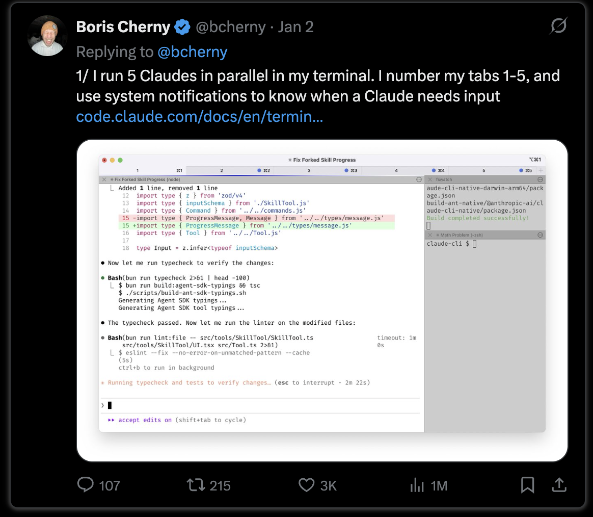

# Claude Code에 대한 완전한 장문 가이드


***

> **전제**: 이 가이드는 [Claude Code에 대한 간략한 가이드](the-shortform-guide.md)를 기반으로 합니다. 아직 skill, hook, subagent, MCP 및 plugin을 설정하지 않았다면, 먼저 해당 가이드를 읽어주세요.


*속기 가이드 - 이 가이드를 먼저 읽어주세요*

간략한 가이드에서는 기본 설정을 소개했습니다: skill과 command, hook, subagent, MCP, plugin, 그리고 효과적인 Claude Code 워크플로우의 근간을 이루는 설정 패턴들입니다. 그것은 설정 가이드이자 기본 아키텍처였습니다.

이 장문 가이드는 효율적인 세션과 낭비되는 세션을 구분하는 기술을 깊이 파고듭니다. 아직 간략한 가이드를 읽지 않았다면, 돌아가서 먼저 설정을 완료하세요. 이하의 내용은 skill, agent, hook, MCP가 이미 구성되어 작동 중이라고 가정합니다.

여기서 다루는 주제는: token 경제, 메모리 영속성, 검증 패턴, 병렬화 전략, 그리고 재사용 가능한 워크플로우 구축의 복합 효과입니다. 이것들은 10개월 이상의 일상적 사용에서 정제한 패턴으로, 첫 한 시간 만에 context 오염으로 고생할 것인지, 아니면 수 시간 동안 생산적인 세션을 유지할 수 있을 것인지를 결정합니다.

간략한 가이드와 장문 가이드에서 다루는 모든 내용은 GitHub에서 찾을 수 있습니다: `github.com/affaan-m/everything-claude-code`

***

## 팁과 요령

### 일부 MCP는 대체 가능하며, context window를 확보할 수 있습니다

버전 관리(GitHub), 데이터베이스(Supabase), 배포(Vercel, Railway) 같은 MCP의 경우 — 이러한 플랫폼 대부분은 이미 견고한 CLI를 가지고 있으며, MCP는 본질적으로 이를 래핑하는 것에 불과합니다. MCP는 좋은 래퍼이지만, 대가가 있습니다.

CLI 기능을 실제 MCP(및 그에 따른 context window 감소) 없이 MCP처럼 작동하게 하려면, 기능을 skill과 command로 패키징하는 것을 고려하세요. MCP가 노출하는, 작업을 쉽게 만드는 도구를 추출하여 command로 변환하세요.

예시: GitHub MCP를 항상 로드하는 대신, `gh pr create`를 선호하는 옵션으로 래핑한 `/gh-pr` command를 만드세요. Supabase MCP가 context를 소비하게 하는 대신, Supabase CLI를 직접 사용하는 skill을 만드세요.

지연 로딩이 도입되면서 context window 문제는 대체로 해결되었습니다. 하지만 token 사용량과 비용 문제는 같은 방식으로 해결되지 않았습니다. CLI + skill 접근법은 여전히 token 최적화 방법입니다.

***

## 중요 사항

### context와 메모리 관리

세션 간에 메모리를 공유하는 가장 좋은 방법은 진행 상황을 요약하고 점검하는 skill이나 command를 사용하여 `.claude` 폴더의 `.tmp` 파일에 저장하고, 세션이 끝나기 전까지 계속 내용을 추가하는 것입니다. 다음 날, 이를 context로 사용하여 중단한 곳에서 계속할 수 있습니다. 각 세션마다 새 파일을 만들어 이전 context가 새 작업을 오염시키지 않도록 하세요.


*세션 저장소 예시 -> <https://github.com/affaan-m/everything-claude-code/tree/main/examples/sessions>*

Claude가 현재 상태를 요약하는 파일을 만듭니다. 이를 검토하고, 필요하면 수정을 요청한 다음 다시 시작하세요. 새 대화에서는 파일 경로만 제공하면 됩니다. context 제한에 도달했는데 복잡한 작업을 계속해야 할 때 특히 유용합니다. 이 파일에는 다음이 포함되어야 합니다:

* 어떤 방법이 효과가 있었는지 (검증할 수 있는 증거 포함)
* 어떤 방법을 시도했지만 효과가 없었는지
* 어떤 방법을 아직 시도하지 않았는지, 그리고 남은 작업은 무엇인지

**전략적 context 정리:**

계획을 세운 후 context를 정리하면(Claude Code의 계획 모드 기본 옵션), 계획에 따라 작업할 수 있습니다. 실행과 더 이상 관련 없는 탐색적 context가 많이 쌓였을 때 유용합니다. 전략적 압축을 위해 자동 압축을 비활성화하세요. 논리적 간격에서 수동으로 압축하거나, 이를 대신 수행하는 skill을 만드세요.

**고급: 동적 시스템 프롬프트 주입**

제가 배운 패턴 중 하나는: 모든 것을 CLAUDE.md(사용자 범위)나 `.claude/rules/`(프로젝트 범위)에 넣어 매 세션마다 로드하는 대신, CLI 플래그를 사용하여 동적으로 context를 주입하는 것입니다.

```bash
claude --system-prompt "$(cat memory.md)"
```

이를 통해 어떤 context를 언제 로드할지 더 정밀하게 제어할 수 있습니다. 시스템 프롬프트 내용은 사용자 메시지보다 더 높은 권위를 가지며, 사용자 메시지는 도구 결과보다 더 높은 권위를 가집니다.

**실제 설정:**

```bash
# Daily development
alias claude-dev='claude --system-prompt "$(cat ~/.claude/contexts/dev.md)"'

# PR review mode
alias claude-review='claude --system-prompt "$(cat ~/.claude/contexts/review.md)"'

# Research/exploration mode
alias claude-research='claude --system-prompt "$(cat ~/.claude/contexts/research.md)"'
```

**고급: 메모리 영속화 hook**

대부분의 사람이 모르는, 메모리 관리에 도움이 되는 hook들이 있습니다:

* **PreCompact hook**: context 압축이 발생하기 전에, 중요한 상태를 파일에 저장
* **Stop hook (세션 종료)**: 세션 종료 시, 학습 성과를 파일에 영속화
* **SessionStart hook**: 새 세션 시작 시, 이전 context를 자동으로 로드

이 hook들을 구축해 두었으며, 저장소의 `github.com/affaan-m/everything-claude-code/tree/main/hooks/memory-persistence`에 있습니다.

***

### 지속적 학습 / 메모리

프롬프트를 여러 번 반복해야 하고, Claude가 같은 문제에 부딪히거나 이전에 들은 적 있는 답변을 하는 경우 — 이러한 패턴은 반드시 skill에 추가해야 합니다.

**문제:** token 낭비, context 낭비, 시간 낭비.

**해결책:** Claude Code가 비자명한 무언가를 발견하면 — 디버깅 기법, 우회 방법, 특정 프로젝트 고유의 패턴 — 해당 지식을 새로운 skill로 저장합니다. 다음에 유사한 문제가 발생하면 해당 skill이 자동으로 로드됩니다.

이 기능을 구현한 지속적 학습 skill을 구축했습니다: `github.com/affaan-m/everything-claude-code/tree/main/skills/continuous-learning`

**왜 Stop hook인가 (UserPromptSubmit이 아닌):**

핵심 설계 결정은 UserPromptSubmit이 아닌 **Stop hook**을 사용하는 것입니다. UserPromptSubmit은 모든 메시지에서 실행되어 — 모든 프롬프트에 지연을 추가합니다. Stop은 세션 종료 시 한 번만 실행되어 — 가볍고, 세션 중에 속도를 저하시키지 않습니다.

***

### Token 최적화

**주요 전략: subagent 아키텍처**

사용하는 도구와 subagent 아키텍처를 최적화하여, 작업을 수행하기에 충분하면서도 가장 저렴한 모델에 위임하는 것을 목표로 하세요.

**모델 선택 빠른 참조:**


*다양한 일반 작업에 대한 subagent 가정 설정 및 선택 이유*

| 작업 유형                 | 모델   | 이유                                       |
| ------------------------- | ------ | ------------------------------------------ |
| 탐색/검색                | Haiku  | 빠르고 저렴하며, 파일 찾기에 충분          |
| 간단한 편집              | Haiku  | 단일 파일 변경, 지시가 명확               |
| 다중 파일 구현            | Sonnet | 코딩에 최적의 균형                         |
| 복잡한 아키텍처           | Opus   | 깊은 추론이 필요                           |
| PR 리뷰                  | Sonnet | context 이해, 미묘한 차이 포착             |
| 보안 분석                | Opus   | 취약점을 놓칠 수 없음                      |
| 문서 작성                | Haiku  | 구조가 단순                                |
| 복잡한 버그 디버깅        | Opus   | 전체 시스템을 머릿속에 담아야 함           |

90%의 코딩 작업에는 기본적으로 Sonnet을 사용하세요. 첫 번째 시도가 실패하거나, 작업이 5개 이상의 파일에 걸치거나, 아키텍처 결정이나 보안 핵심 코드일 때 Opus로 업그레이드하세요.

**가격 참조:**


*출처: <https://platform.claude.com/docs/en/about-claude/pricing>*

**도구별 최적화:**

grep을 mgrep으로 대체하세요 — 기존 grep이나 ripgrep과 비교하여 평균 약 50%의 token 절감:


*50개 작업 벤치마크에서 mgrep + Claude Code는 유사하거나 더 나은 판단 품질로 grep 기반 워크플로우보다 약 2배 적은 token을 사용했습니다. 출처: @mixedbread-ai의 mgrep*

**모듈화된 코드베이스의 이점:**

메인 파일이 수천 줄이 아닌 수백 줄로 구성된 더 모듈화된 코드베이스를 갖추면, token 최적화 비용을 줄이고 작업이 첫 번째 시도에서 올바르게 완료되도록 하는 데 도움이 됩니다.

***

### 검증 루프와 평가

**벤치마크 워크플로우:**

skill이 있는 경우와 없는 경우에 동일한 것을 물어보고 출력 차이를 확인하세요:

대화를 분기하고, 그중 하나의 대화에서 새로운 worktree를 초기화하되 해당 skill을 사용하지 않은 다음, 마지막에 diff를 가져와서 무엇이 기록되었는지 확인하세요.

**평가 모드 유형:**

* **체크포인트 기반 평가**: 명확한 체크포인트를 설정하고, 정의된 기준에 따라 검증하며, 계속하기 전에 수정
* **지속적 평가**: N분마다 또는 중요한 변경 후 실행, 전체 테스트 스위트 + 코드 검사

**핵심 지표:**

```
pass@k: At least ONE of k attempts succeeds
        k=1: 70%  k=3: 91%  k=5: 97%

pass^k: ALL k attempts must succeed
        k=1: 70%  k=3: 34%  k=5: 17%
```

작동하기만 하면 될 때는 **pass@k**를 사용하세요. 일관성이 중요할 때는 **pass^k**를 사용하세요.

***

## 병렬화

다중 Claude 터미널 설정에서 대화를 분기할 때, 분기된 작업과 원래 대화의 범위가 명확하게 정의되도록 하세요. 코드 변경 측면에서 중복을 최소화하도록 노력하세요.

**제가 선호하는 패턴:**

메인 채팅은 코드 변경용으로, 분기는 코드베이스와 현재 상태에 대한 질문이나 외부 서비스 조사용으로 사용합니다.

**임의의 터미널 수에 대해:**


*Boris (Anthropic)의 다중 Claude 인스턴스 실행에 관한 설명*

Boris는 병렬화에 대한 조언이 있습니다. 그는 로컬에서 5개, 업스트림에서 5개의 Claude 인스턴스를 실행하라고 제안한 적이 있습니다. 저는 임의의 터미널 수를 설정하는 것을 권장하지 않습니다. 터미널 추가는 진정한 필요성에 의해 이루어져야 합니다.

목표는 다음이어야 합니다: **최소한의 병렬화로 얼마나 많은 작업을 완료할 수 있는가.**

**병렬 인스턴스를 위한 Git Worktree:**

```bash
# Create worktrees for parallel work
git worktree add ../project-feature-a feature-a
git worktree add ../project-feature-b feature-b
git worktree add ../project-refactor refactor-branch

# Each worktree gets its own Claude instance
cd ../project-feature-a && claude
```

**만약** 인스턴스 수를 늘리기 시작하고 **그리고** 여러 Claude 인스턴스가 서로 겹치는 코드를 다루고 있다면, 반드시 git worktree를 사용하고 각 인스턴스에 대해 매우 명확한 계획을 세워야 합니다. `/rename <name here>`를 사용하여 모든 채팅에 이름을 지정하세요.


*초기 설정: 왼쪽 터미널은 코딩용, 오른쪽 터미널은 질문용 - /rename과 /fork command 사용*

**캐스케이드 방식:**

여러 Claude Code 인스턴스를 실행할 때, "캐스케이드" 패턴으로 정리하세요:

* 오른쪽의 새 탭에서 새 작업을 엽니다
* 왼쪽에서 오른쪽으로, 오래된 것에서 새로운 것 순으로 스캔합니다
* 한 번에 최대 3-4개 작업에 집중합니다

***

## 기초 작업

**이중 인스턴스 시작 패턴:**

저만의 워크플로우 관리를 위해, 빈 저장소에서 시작하여 2개의 Claude 인스턴스를 여는 것을 좋아합니다.

**인스턴스 1: 스캐폴딩 agent**

* 스캐폴딩과 기초 작업
* 프로젝트 구조 생성
* 설정 구성 (CLAUDE.md, 규칙, agent)

**인스턴스 2: 심층 리서치 agent**

* 모든 서비스에 연결하고, 웹 검색 수행
* 상세한 PRD 작성
* 아키텍처 Mermaid 다이어그램 작성
* 실제 문서 조각이 포함된 참고 자료 수집

**llms.txt 패턴:**

가능한 경우, 문서 페이지에 도달한 후 `/llms.txt`를 실행하여 많은 문서 참고 자료에서 `llms.txt`를 찾을 수 있습니다. 이를 통해 깔끔한 LLM 최적화 버전의 문서를 얻을 수 있습니다.

**철학: 재사용 가능한 패턴 구축**

@omarsar0의 말: "초기에 재사용 가능한 워크플로우/패턴을 구축하는 데 시간을 투자했습니다. 구축 과정은 번거로웠지만, 모델과 agent 프레임워크가 개선되면서 놀라운 복합 효과를 만들어냈습니다."

**투자해야 할 것:**

* Subagent
* Skill
* Command
* 계획 패턴
* MCP 도구
* Context 엔지니어링 패턴

***

## Agent와 subagent 모범 사례

**Subagent context 문제:**

Subagent는 모든 것을 덤프하는 대신 요약을 반환하여 context를 절약하기 위해 존재합니다. 하지만 오케스트레이터는 subagent에게 없는 의미론적 context를 가지고 있습니다. Subagent는 문자 그대로의 쿼리만 알 뿐, 요청 뒤의 **목적**은 알지 못합니다.

**반복적 검색 패턴:**

1. 오케스트레이터가 각 subagent의 반환을 평가
2. 수락하기 전에 후속 질문을 함
3. Subagent가 소스를 반환하고, 답변을 얻고, 반환
4. 충분할 때까지 반복 (최대 3 사이클)

**핵심:** 쿼리만이 아닌, 목표 context를 전달하세요.

**순차적 단계를 가진 오케스트레이터:**

```markdown
第一阶段：研究（使用探索智能体）→ research-summary.md
第二阶段：规划（使用规划智能体）→ plan.md
第三阶段：实施（使用测试驱动开发指南智能体）→ 代码变更
第四阶段：审查（使用代码审查智能体）→ review-comments.md
第五阶段：验证（如需则使用构建错误解决器）→ 完成或循环返回

```

**핵심 규칙:**

1. 각 agent는 하나의 명확한 입력을 받고 하나의 명확한 출력을 생성
2. 출력이 다음 단계의 입력이 됨
3. 절대 단계를 건너뛰지 않기
4. Agent 간에 `/clear` 사용
5. 중간 출력을 파일에 저장

***

## 재미있는 것들 / 중요하지 않지만, 재미를 위한 팁

### 커스텀 상태 바

`/statusline`을 사용하여 설정할 수 있습니다 - 그러면 Claude가 상태 바가 없다고 말하지만, 설정해 줄 수 있다며 무엇을 넣고 싶은지 물어봅니다.

참고: ccstatusline (Claude Code 상태 바를 커스터마이징하기 위한 커뮤니티 프로젝트)

### 음성 전사

음성으로 Claude Code와 대화하세요. 많은 사람에게 타이핑보다 빠릅니다.

* Mac에서 superwhisper, MacWhisper
* 전사가 잘못되더라도 Claude는 의도를 이해할 수 있습니다

### 터미널 별칭

```bash
alias c='claude'
alias gb='github'
alias co='code'
alias q='cd ~/Desktop/projects'
```

***

## 마일스톤


*일주일 만에 25,000+ GitHub star 달성*

***

## 리소스

**Agent 오케스트레이션:**

* claude-flow — 54개 이상의 전문 agent를 포함한 커뮤니티 구축 엔터프라이즈급 오케스트레이션 플랫폼

**자기 개선 메모리:**

* 이 저장소의 `skills/continuous-learning/` 참조
* rlancemartin.github.io/2025/12/01/claude\_diary/ - 세션 회고 패턴

**시스템 프롬프트 참조:**

* system-prompts-and-models-of-ai-tools — 커뮤니티에서 수집한 AI 시스템 프롬프트 (110k+ star)

**공식:**

* Anthropic Academy: anthropic.skilljar.com

***

## 참고 문헌

* [Anthropic: AI agent 평가의 이해](https://www.anthropic.com/engineering/demystifying-evals-for-ai-agents)
* [YK: 32가지 Claude Code 팁](https://agenticcoding.substack.com/p/32-claude-code-tips-from-basics-to)
* [RLanceMartin: 세션 회고 패턴](https://rlancemartin.github.io/2025/12/01/claude_diary/)
* @PerceptualPeak: subagent context 협상
* @menhguin: agent 추상화 계층 분류
* @omarsar0: 복합 효과 철학

***

*두 가이드에서 다루는 모든 내용은 GitHub의 [everything-claude-code](https://github.com/affaan-m/everything-claude-code)에서 찾을 수 있습니다*
