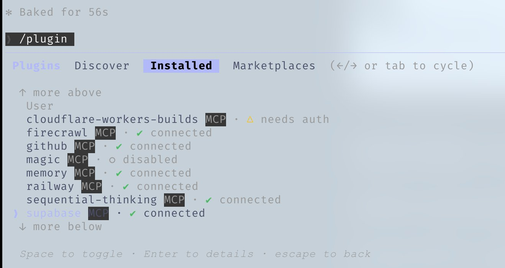

# Claude Code 간결 가이드


***

**2월 실험적 출시 이후 저는 Claude Code의 열렬한 사용자였으며, [@DRodriguezFX](https://x.com/DRodriguezFX)와 함께 [zenith.chat](https://zenith.chat)으로 Anthropic x Forum Ventures 해커톤에서 우승했습니다 — 전적으로 Claude Code를 사용해서요.**

10개월간의 일상적 사용을 거쳐, 제 전체 설정을 공유합니다: skill, hook, subagent, MCP, plugin 그리고 실제로 효과적인 방법들.

***

## Skill과 Command

Skill은 특정 범위와 흐름에 한정된 규칙과 같습니다. 특정 워크플로우를 실행해야 할 때 프롬프트의 단축어 역할을 합니다.

Opus 4.5로 오랜 코딩 세션 후 죽은 코드와 불필요한 .md 파일을 정리하고 싶으신가요? `/refactor-clean`을 실행하세요. 테스트가 필요하신가요? `/tdd`, `/e2e`, `/test-coverage`. Skill에는 코드 맵도 포함할 수 있습니다 — Claude가 탐색에 컨텍스트를 소비하지 않고도 코드베이스를 빠르게 파악할 수 있는 방법입니다.


*command를 체이닝하기*

Command는 slash command로 실행되는 skill입니다. 겹치는 부분이 있지만 저장 방식이 다릅니다:

* **Skill**: `~/.claude/skills/` - 더 넓은 워크플로우 정의
* **Command**: `~/.claude/commands/` - 빠르게 실행 가능한 프롬프트

```bash
# Example skill structure
~/.claude/skills/
  pmx-guidelines.md      # Project-specific patterns
  coding-standards.md    # Language best practices
  tdd-workflow/          # Multi-file skill with README.md
  security-review/       # Checklist-based skill
```

***

## Hook

Hook은 특정 이벤트가 발생할 때 실행되는 트리거 기반 자동화입니다. Skill과 달리, 도구 호출과 생명주기 이벤트에 한정됩니다.

**Hook 유형:**

1. **PreToolUse** - 도구 실행 전 (검증, 알림)
2. **PostToolUse** - 도구 완료 후 (포맷팅, 피드백 루프)
3. **UserPromptSubmit** - 메시지를 보낼 때
4. **Stop** - Claude가 응답을 완료했을 때
5. **PreCompact** - 컨텍스트 압축 전
6. **Notification** - 권한 요청

**예시: 오래 실행되는 command 전 tmux 알림**

```json
{
  "PreToolUse": [
    {
      "matcher": "tool == \"Bash\" && tool_input.command matches \"(npm|pnpm|yarn|cargo|pytest)\"",
      "hooks": [
        {
          "type": "command",
          "command": "if [ -z \"$TMUX\" ]; then echo '[Hook] Consider tmux for session persistence' >&2; fi"
        }
      ]
    }
  ]
}
```


*Claude Code에서 PostToolUse hook 실행 시 받는 피드백 예시*

**프로 팁:** JSON을 수동으로 작성하는 대신 `hookify` plugin을 사용하여 대화형으로 hook을 만드세요. `/hookify`를 실행하고 원하는 것을 설명하면 됩니다.

***

## Subagent

Subagent는 오케스트레이터(메인 Claude)가 제한된 범위의 작업을 위임할 수 있는 프로세스입니다. 백그라운드 또는 포그라운드에서 실행되어 메인 agent의 컨텍스트를 확보합니다.

Subagent는 skill과 잘 어울립니다 — skill의 하위 집합을 실행할 수 있는 subagent에게 작업을 위임하면 해당 skill을 자율적으로 사용합니다. 특정 도구 권한으로 샌드박스화할 수도 있습니다.

```bash
# Example subagent structure
~/.claude/agents/
  planner.md           # Feature implementation planning
  architect.md         # System design decisions
  tdd-guide.md         # Test-driven development
  code-reviewer.md     # Quality/security review
  security-reviewer.md # Vulnerability analysis
  build-error-resolver.md
  e2e-runner.md
  refactor-cleaner.md
```

각 subagent에 허용된 도구, MCP 및 권한을 설정하여 적절한 범위를 지정하세요.

***

## 규칙과 메모리

`.rules` 폴더에는 Claude가 항상 따라야 할 모범 사례가 담긴 `.md` 파일이 있습니다. 두 가지 접근법이 있습니다:

1. **단일 CLAUDE.md** - 모든 내용을 하나의 파일에 (사용자 또는 프로젝트 수준)
2. **규칙 폴더** - 관심사별로 그룹화된 모듈식 `.md` 파일

```bash
~/.claude/rules/
  security.md      # No hardcoded secrets, validate inputs
  coding-style.md  # Immutability, file organization
  testing.md       # TDD workflow, 80% coverage
  git-workflow.md  # Commit format, PR process
  agents.md        # When to delegate to subagents
  performance.md   # Model selection, context management
```

**규칙 예시:**

* 코드베이스에 이모지 사용 금지
* 프론트엔드에서 보라색 톤 사용 금지
* 배포 전 항상 코드 테스트
* 거대한 파일보다 모듈식 코드 우선
* console.log 절대 커밋 금지

***

## MCP (Model Context Protocol)

MCP는 Claude를 외부 서비스에 직접 연결합니다. API의 대체가 아니라 — API를 감싸는 프롬프트 기반 래퍼로, 정보 탐색 시 더 큰 유연성을 제공합니다.

**예시:** Supabase MCP는 Claude가 특정 데이터를 추출하고, 복사-붙여넣기 없이 상위에서 직접 SQL을 실행할 수 있게 합니다. 데이터베이스, 배포 플랫폼 등도 마찬가지입니다.


*Supabase MCP가 public 스키마 내 테이블을 나열하는 예시*

**Claude의 Chrome:** Claude가 자율적으로 브라우저를 제어할 수 있는 내장 plugin MCP입니다 — 클릭하여 작동 방식을 확인합니다.

**핵심: 컨텍스트 윈도우 관리**

MCP는 까다롭게 선택하세요. 저는 모든 MCP를 사용자 설정에 저장하지만 **사용하지 않는 것은 모두 비활성화**합니다. `/plugins`로 이동하여 아래로 스크롤하거나 `/mcp`를 실행하세요.


*/plugins를 사용하여 MCP로 이동하면 현재 설치된 plugin과 상태를 확인할 수 있습니다*

압축 전, 200k 컨텍스트 윈도우가 너무 많은 도구가 활성화되면 70k만 사용 가능할 수 있습니다. 성능이 현저히 저하됩니다.

**경험 법칙:** 설정에 MCP를 20-30개 보관하되, 활성화는 10개 미만 / 활성 도구는 80개 미만으로 유지하세요.

```bash
# Check enabled MCPs
/mcp

# Disable unused ones in ~/.claude.json under projects.disabledMcpServers
```

***

## Plugin

Plugin은 번거로운 수동 설정 대신 도구를 패키징하여 쉽게 설치할 수 있게 합니다. Plugin은 skill과 MCP의 조합이거나, hook/도구가 번들로 묶인 것일 수 있습니다.

**Plugin 설치:**

```bash
# Add a marketplace
# mgrep plugin by @mixedbread-ai
claude plugin marketplace add https://github.com/mixedbread-ai/mgrep

# Open Claude, run /plugins, find new marketplace, install from there
```


*새로 설치된 Mixedbread-Grep 마켓플레이스*

**LSP plugin**은 에디터 외부에서 Claude Code를 자주 실행하는 경우 특히 유용합니다. Language Server Protocol은 IDE를 열지 않고도 Claude에게 실시간 타입 검사, 정의로 이동, 스마트 자동완성을 제공합니다.

```bash
# Enabled plugins example
typescript-lsp@claude-plugins-official  # TypeScript intelligence
pyright-lsp@claude-plugins-official     # Python type checking
hookify@claude-plugins-official         # Create hooks conversationally
mgrep@Mixedbread-Grep                   # Better search than ripgrep
```

MCP와 동일한 주의사항 — 컨텍스트 윈도우에 유의하세요.

***

## 팁과 요령

### 키보드 단축키

* `Ctrl+U` - 전체 줄 삭제 (백스페이스를 반복하는 것보다 빠름)
* `!` - 빠른 bash command 접두사
* `@` - 파일 검색
* `/` - slash command 시작
* `Shift+Enter` - 여러 줄 입력
* `Tab` - 사고 표시 전환
* `Esc Esc` - Claude 중단 / 코드 복원

### 병렬 워크플로우

* **Fork** (`/fork`) - 대화를 분기하여 겹치지 않는 작업을 큐에 쌓지 않고 병렬로 실행
* **Git Worktree** - 충돌 없이 겹치는 병렬 Claude를 위해 사용. 각 worktree는 독립된 체크아웃

```bash
git worktree add ../feature-branch feature-branch
# Now run separate Claude instances in each worktree
```

### 오래 실행되는 command를 위한 tmux

Claude가 실행하는 로그/bash 프로세스의 스트리밍 및 모니터링:

<https://github.com/user-attachments/assets/shortform/07-tmux-video.mp4>

```bash
tmux new -s dev
# Claude runs commands here, you can detach and reattach
tmux attach -t dev
```

### mgrep > grep

`mgrep`은 ripgrep/grep보다 현저히 개선된 도구입니다. plugin 마켓플레이스를 통해 설치한 다음 `/mgrep` skill을 사용하세요. 로컬 검색과 웹 검색 모두 지원합니다.

```bash
mgrep "function handleSubmit"  # Local search
mgrep --web "Next.js 15 app router changes"  # Web search
```

### 기타 유용한 command

* `/rewind` - 이전 상태로 돌아가기
* `/statusline` - 브랜치, 컨텍스트 백분율, 할 일로 커스터마이즈
* `/checkpoints` - 파일 수준 되돌리기 지점
* `/compact` - 수동으로 컨텍스트 압축 트리거

### GitHub Actions CI/CD

GitHub Actions를 사용하여 PR에 코드 리뷰를 설정하세요. 설정하면 Claude가 자동으로 PR을 리뷰할 수 있습니다.


*Claude가 버그 수정 PR을 승인하는 모습*

### 샌드박스화

위험한 작업에는 샌드박스 모드를 사용하세요 — Claude가 실제 시스템에 영향을 주지 않는 제한된 환경에서 실행됩니다.

***

## 에디터에 대하여

에디터 선택은 Claude Code 워크플로우에 큰 영향을 미칩니다. Claude Code는 어떤 터미널에서든 작동하지만, 강력한 에디터와 함께 사용하면 실시간 파일 추적, 빠른 탐색, 통합 command 실행이 가능해집니다.

### Zed (제 선택)

저는 [Zed](https://zed.dev)를 사용합니다 — Rust로 작성되어 정말 빠릅니다. 즉시 열리고, 대형 코드베이스를 쉽게 처리하며, 시스템 자원을 거의 소모하지 않습니다.

**Zed + Claude Code가 최고의 조합인 이유:**

* **속도** - Rust 기반 성능으로 Claude가 빠르게 파일을 편집할 때 지연이 없습니다. 에디터가 속도를 따라갑니다
* **Agent 패널 통합** - Zed의 Claude 통합으로 Claude가 편집하는 동안 실시간으로 파일 변경을 추적할 수 있습니다. 에디터를 떠나지 않고 Claude가 참조하는 파일로 이동 가능
* **CMD+Shift+R command 팔레트** - 모든 커스텀 slash command, 디버거, 빌드 스크립트에 검색 가능한 UI로 빠르게 접근
* **최소한의 자원 사용** - 무거운 작업 중 Claude와 RAM/CPU를 경쟁하지 않습니다. Opus 실행 시 중요
* **Vim 모드** - 원하시면 완전한 vim 키 바인딩 사용 가능


*CMD+Shift+R로 커스텀 command 드롭다운이 있는 Zed 에디터. 우하단의 과녁 아이콘은 팔로우 모드가 활성화되어 있음을 나타냅니다.*

**에디터 무관 팁:**

1. **화면을 분할하세요** - 한쪽은 Claude Code가 있는 터미널, 다른 쪽은 에디터
2. **Ctrl + G** - Zed에서 Claude가 현재 작업 중인 파일을 빠르게 열기
3. **자동 저장** - Claude의 파일 읽기가 항상 최신 상태가 되도록 자동 저장 활성화
4. **Git 통합** - 에디터의 git 기능을 사용하여 커밋 전 Claude의 변경 사항 검토
5. **파일 감시자** - 대부분의 에디터가 변경된 파일을 자동 리로드합니다. 활성화 여부를 확인하세요

### VSCode / Cursor

이것도 좋은 선택이며 Claude Code와 잘 작동합니다. 터미널 형식을 사용하여 `\ide`로 에디터와 자동 동기화하여 LSP 기능을 활성화할 수 있습니다 (현재 plugin과 다소 중복). 또는 에디터에 더 통합되고 매칭되는 UI를 가진 확장 프로그램을 선택할 수 있습니다.


*VS Code 확장 프로그램은 Claude Code를 위한 네이티브 그래픽 인터페이스를 IDE에 직접 통합합니다.*

***

## 제 설정

### Plugin

**설치됨:** (보통 한 번에 4-5개만 활성화합니다)

```markdown
ralph-wiggum@claude-code-plugins       # 循环自动化
frontend-design@claude-code-plugins    # UI/UX 模式
commit-commands@claude-code-plugins    # Git 工作流
security-guidance@claude-code-plugins  # 安全检查
pr-review-toolkit@claude-code-plugins  # PR 自动化
typescript-lsp@claude-plugins-official # TS 智能
hookify@claude-plugins-official        # Hook 创建
code-simplifier@claude-plugins-official
feature-dev@claude-code-plugins
explanatory-output-style@claude-code-plugins
code-review@claude-code-plugins
context7@claude-plugins-official       # 实时文档
pyright-lsp@claude-plugins-official    # Python 类型
mgrep@Mixedbread-Grep                  # 更好的搜索

```

### MCP 서버

**설정됨 (사용자 수준):**

```json
{
  "github": { "command": "npx", "args": ["-y", "@modelcontextprotocol/server-github"] },
  "firecrawl": { "command": "npx", "args": ["-y", "firecrawl-mcp"] },
  "supabase": {
    "command": "npx",
    "args": ["-y", "@supabase/mcp-server-supabase@latest", "--project-ref=YOUR_REF"]
  },
  "memory": { "command": "npx", "args": ["-y", "@modelcontextprotocol/server-memory"] },
  "sequential-thinking": {
    "command": "npx",
    "args": ["-y", "@modelcontextprotocol/server-sequential-thinking"]
  },
  "vercel": { "type": "http", "url": "https://mcp.vercel.com" },
  "railway": { "command": "npx", "args": ["-y", "@railway/mcp-server"] },
  "cloudflare-docs": { "type": "http", "url": "https://docs.mcp.cloudflare.com/mcp" },
  "cloudflare-workers-bindings": {
    "type": "http",
    "url": "https://bindings.mcp.cloudflare.com/mcp"
  },
  "clickhouse": { "type": "http", "url": "https://mcp.clickhouse.cloud/mcp" },
  "AbletonMCP": { "command": "uvx", "args": ["ableton-mcp"] },
  "magic": { "command": "npx", "args": ["-y", "@magicuidesign/mcp@latest"] }
}
```

이것이 핵심입니다 — 14개의 MCP를 설정했지만 프로젝트당 약 5-6개만 활성화합니다. 컨텍스트 윈도우를 건강하게 유지하세요.

### 주요 Hook

```json
{
  "PreToolUse": [
    { "matcher": "npm|pnpm|yarn|cargo|pytest", "hooks": ["tmux reminder"] },
    { "matcher": "Write && .md file", "hooks": ["block unless README/CLAUDE"] },
    { "matcher": "git push", "hooks": ["open editor for review"] }
  ],
  "PostToolUse": [
    { "matcher": "Edit && .ts/.tsx/.js/.jsx", "hooks": ["prettier --write"] },
    { "matcher": "Edit && .ts/.tsx", "hooks": ["tsc --noEmit"] },
    { "matcher": "Edit", "hooks": ["grep console.log warning"] }
  ],
  "Stop": [
    { "matcher": "*", "hooks": ["check modified files for console.log"] }
  ]
}
```

### 커스텀 상태 줄

사용자, 디렉토리, 더티 마커가 있는 git 브랜치, 남은 컨텍스트 백분율, 모델, 시간, 할 일 카운트를 표시합니다:


*Mac 루트 디렉토리에서의 상태 줄 예시*

```
affoon:~ ctx:65% Opus 4.5 19:52
▌▌ plan mode on (shift+tab to cycle)
```

### 규칙 구조

```
~/.claude/rules/
  security.md      # Mandatory security checks
  coding-style.md  # Immutability, file size limits
  testing.md       # TDD, 80% coverage
  git-workflow.md  # Conventional commits
  agents.md        # Subagent delegation rules
  patterns.md      # API response formats
  performance.md   # Model selection (Haiku vs Sonnet vs Opus)
  hooks.md         # Hook documentation
```

### Subagent

```
~/.claude/agents/
  planner.md           # Break down features
  architect.md         # System design
  tdd-guide.md         # Write tests first
  code-reviewer.md     # Quality review
  security-reviewer.md # Vulnerability scan
  build-error-resolver.md
  e2e-runner.md        # Playwright tests
  refactor-cleaner.md  # Dead code removal
  doc-updater.md       # Keep docs synced
```

***

## 핵심 요점

1. **과도하게 복잡하게 만들지 마세요** - 설정을 아키텍처가 아닌 미세 조정으로 생각하세요
2. **컨텍스트 윈도우는 소중합니다** - 사용하지 않는 MCP와 plugin을 비활성화하세요
3. **병렬 실행** - 대화를 fork하고 git worktree를 사용하세요
4. **반복 작업을 자동화하세요** - 포맷팅, 린팅, 알림을 위한 hook
5. **Subagent의 범위를 제한하세요** - 제한된 도구 = 집중된 실행

***

## 참고 자료

* [Plugin 참조](https://code.claude.com/docs/en/plugins-reference)
* [Hook 문서](https://code.claude.com/docs/en/hooks)
* [Checkpoint](https://code.claude.com/docs/en/checkpointing)
* [인터랙티브 모드](https://code.claude.com/docs/en/interactive-mode)
* [메모리 시스템](https://code.claude.com/docs/en/memory)
* [Subagent](https://code.claude.com/docs/en/sub-agents)
* [MCP 개요](https://code.claude.com/docs/en/mcp-overview)

***

**참고:** 이것은 세부 내용의 일부입니다. 고급 패턴에 대해서는 [상세 가이드](the-longform-guide.md)를 참조하세요.

***

*뉴욕에서 [@DRodriguezFX](https://x.com/DRodriguezFX)와 함께 [zenith.chat](https://zenith.chat)을 구축하여 Anthropic x Forum Ventures 해커톤에서 우승*
